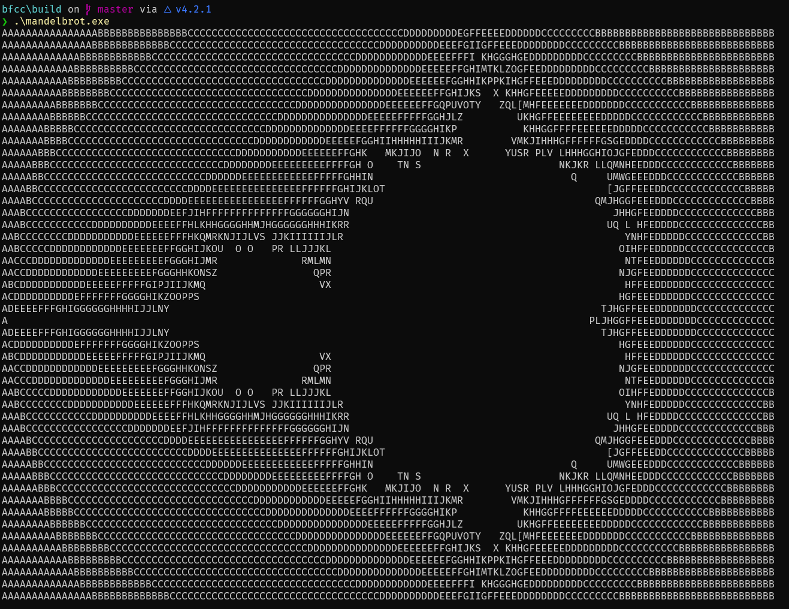

# bfcc

Brainfuck (Overly)Complicated Compiler. A compiler + interpreter for Brainfuck that builds an IR, emits x86_64 assembly, and drives clang to produce a Windows executable.



## Features

- Interpreter mode for quick runs.
- Native build mode via clang on Windows (x86_64).
- Optional IR dump and simple optimizations.

## Build

Prereqs:

- CMake 3.25+
- C++23 compiler
- clang in PATH (required for `bfcc build`)
- Git submodules initialized (Boost)

Commands:

```powershell
git clone --recursive <repo-url>
cmake -S . -B build -DCMAKE_BUILD_TYPE=RelWithDebInfo
cmake --build build
```

Binary location depends on the generator. Common locations:

- `build/bfcc.exe` (single-config)
- `build/Release/bfcc.exe` (multi-config)

## Run

Interpreter mode:

```powershell
.\bfcc run examples/mandelbrot.bf
```

Build an executable and run it:

```powershell
.\bfcc build examples/mandelbrot.bf -o mandelbrot
.\mandelbrot.exe
```

Helpful flags:

- `--list-targets` to see available targets
- `--emit-ir` to print the IR
- `-O` to enable optimizations
- `-v` for verbose build info

## Performance

On the Mandelbrot example, the compiled binary runs about 24x faster than the interpreter:

```text
> hyperfine '.\bfcc run ../examples/mandelbrot.bf' '.\mandelbrot.exe'
Benchmark 1: .\bfcc run ../examples/mandelbrot.bf
  Time (mean +/- sigma):     15.816 s +/- 0.040 s    [User: 15.448 s, System: 0.132 s]
  Range (min ... max):       15.738 s ... 15.864 s    10 runs

Benchmark 2: .\mandelbrot.exe
  Time (mean +/- sigma):     655.7 ms +/- 3.1 ms    [User: 624.1 ms, System: 15.0 ms]
  Range (min ... max):       651.9 ms ... 659.9 ms    10 runs

Summary
  .\mandelbrot.exe ran
   24.12 +/- 0.13 times faster than .\bfcc run ../examples/mandelbrot.bf
```
